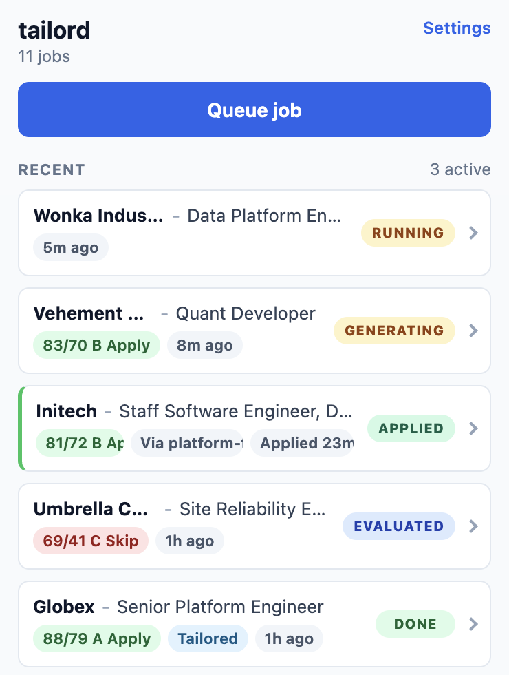
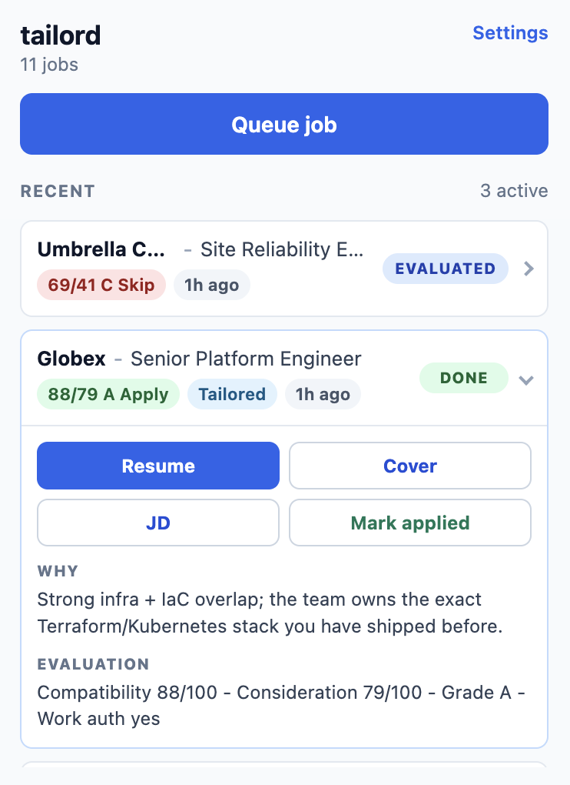

# tailord

[](LICENSE)

A **local, evidence-backed job-application workbench.**

Bring your own facts. Keep them on your machine. Let an agent tailor every
application against an evidence corpus you control.

`tailord` renders YAML resume facts into deterministic PDFs, generates
matching cover letters, scores job descriptions against your real evidence,
and ships a browser extension + local bridge that evaluates a LinkedIn job
page first, then generates a resume or resume + cover letter only when you
ask — all on your laptop, driven by your local [Claude Code](https://docs.claude.com/en/docs/claude-code)
(`claude` CLI). Nothing leaves the box except the model calls Claude Code makes.

<p align="center">
  
  &nbsp;&nbsp;
  
</p>

<p align="center"><sub>The browser extension popup: every queued job's fit evaluation at a glance (left), and a single job expanded with its tailored PDF, rationale, and score breakdown (right).</sub></p>

## Features

| Feature | Status |
| --- | --- |
| Resume PDF rendering (Jinja + Playwright) | ✅ |
| Cover-letter PDF rendering (same pipeline) | ✅ |
| JSON-Schema-validated YAML vault | ✅ |
| Sample vault + CI build | ✅ |
| `tailord` CLI (init / validate / build / cover / preview / doctor / install-browsers) | ✅ |
| `tailord import` from existing .txt / .md / .pdf resumes | ✅ |
| `score-job` against your vault via local Claude Code (`claude` CLI) | ✅ |
| Local token usage + cost stats for pricing decisions | ✅ |
| Browser extension + bridge (LinkedIn → evaluate → generate PDFs) | ✅ |
| Full headless tailoring pipeline from the CLI | ⏳ planned |
| Adapters for sites beyond LinkedIn | ⏳ planned |

## Quick start

### Prerequisites

- Python 3.11+ and [pipx](https://pipx.pypa.io/)
- [Claude Code](https://docs.claude.com/en/docs/claude-code) (the `claude` CLI) — the LLM-backed commands (`score-job`, `import`) and the browser extension drive your local `claude` install. This is the path tailord actually uses; there's no separate API key to configure.
- Node.js 20.6+ — only for the browser extension + local bridge

### Setup

```bash
# 1. Install. [pdf] pulls in Playwright for PDF rendering. The direct-reference
#    form matters: the extra goes before the @, not at the end of the Git URL.
#    Keep the whole spec quoted because it contains [].
pipx install 'tailord[pdf] @ git+https://github.com/sarthak22gaur/tailord.git'
tailord install-browsers

# 2. Scaffold a vault
tailord init ~/resume-vault

# 2.5 Optional: replace the sample with a draft imported from an old resume
cd ~/resume-vault
tailord import ~/Downloads/old-resume.pdf --force

# 3. Render a resume
tailord build --variant master
# → ~/resume-vault/output/jane_doe_master.pdf

# 4. (optional) Score a JD against your vault. Uses your local `claude` CLI.
cat > acme-jd.txt <<'EOF'
Acme Corp is hiring a Senior Platform Engineer to build distributed systems,
operate Python and TypeScript services, and improve reliability.
EOF
tailord score-job ./acme-jd.txt
```

The base install (no extras) ships the validators, skill loader, and
`tailord import` support. Add `[pdf]` for `tailord build` / `cover` /
`preview`. The LLM-backed commands (`score-job`, `import`) shell out to your
local `claude` CLI — no API key required.

> **Note:** an alternative `--runner anthropic_api` path exists (install the
> `[api]` extra and set `ANTHROPIC_API_KEY`), but it is **untested** — the
> supported and exercised path is the local `claude` CLI.

See [docs/quickstart.md](docs/quickstart.md) for the 10-minute walk-through.

v0.1.0 is published only via git+https; a PyPI release is planned once
the install flow has been validated by a few real users.

## Usage

```
tailord init <path>             scaffold a vault from the sample
tailord validate                 schema + structural checks
tailord lint                     house-style bullet lint (weak verbs, filler)
tailord doctor                   config + dependency sanity check
tailord install-browsers         install Chromium for PDF rendering
tailord build [--variant X]      render a resume PDF       (needs [pdf])
tailord cover [--variant X]      render a cover-letter PDF (needs [pdf])
tailord preview [--variant X]    hot-reload preview server (HTML)
tailord import <path|->          extract data/master.yaml from .txt/.md/.pdf
tailord score-job <jd>           score a JD against the vault (local claude CLI)
tailord stats                    summarize local LLM token usage and cost
tailord sync-skills              regenerate .claude/.codex/.opencode/ skill
                                 dirs from src/tailord/skills/ (clone only)
tailord setup-bridge             install local jd-bridge runtime + npm deps
tailord serve                    start the jd-bridge HTTP server
```

`--vault PATH` works as a top-level override on any subcommand.

## The browser extension

The Chrome extension is the recommended job-page workflow. It talks to the local
`jd-bridge` HTTP server installed by `tailord setup-bridge`; JD text is posted
only to that local bridge. The first Chrome Web Store release is intended to be
unlisted, and the source tree can also build Chrome/Firefox zip artifacts for
manual install or review. Workflow:

1. Open a LinkedIn job page.
2. Click "Queue this job" in the extension popup.
3. The extension extracts the visible JD from the page DOM and POSTs it
   to your local bridge.
4. The bridge invokes `claude -p` against this repo and runs
   `resume-job-fit-evaluator` first.
5. The popup shows the evaluation (see the screenshots above). From there you
   can generate a resume, generate a resume + cover letter, or skip the role.

See [docs/advanced/extension.md](docs/advanced/extension.md) for Chrome Store,
local bridge, and developer sideload setup.

## Architecture

Two pieces, clean ownership boundary:

```
┌──────────────────────────┐     ┌────────────────────────┐
│  framework (this repo)   │     │  vault (you own this)  │
│  ──────────────────────  │     │  ──────────────────    │
│  src/tailord/            │     │  data/master.yaml      │
│  ├─ {cli,build,render…}  │     │  data/variants/*.yaml  │
│  ├─ templates/           │ ──► │  data/cover-letter-*   │
│  ├─ schemas/             │     │  data/user-preferences │
│  ├─ skills/              │     │  docs/resume-research/ │
│  └─ examples/sample-vault│     │  jobs/generated/       │
│  tools/jd-bridge/        │     │  output/               │
│  tools/jd-extension/     │     │                        │
└──────────────────────────┘     └────────────────────────┘
```

- **Framework** is what `pipx install` puts on your machine: renderer,
  templates, agent skills, schemas, and a sample vault CI builds against.
  The local browser bridge is shipped as packaged data; `tailord setup-bridge`
  copies it into a user-writable runtime dir before running `npm install`.
- **Vault** is your private content. Live or `.gitignore`'d, your choice.
  Discovered via `RESUME_VAULT`, `.resumerc.yaml` in any ancestor dir, or
  `$XDG_CONFIG_HOME/tailord/config.yaml`.

See [POSITIONING.md](POSITIONING.md) for the locked design decisions and
[docs/vault-anatomy.md](docs/vault-anatomy.md) for what every file in a
vault means.

## Why this exists

Tailoring a resume to every JD is universally painful. The hosted tools
(Teal, Jobscan) want your career history in their database and optimize for
ATS keyword overlap. This project takes the opposite stance:

- **Your facts stay local.** A vault is just a directory of YAML and
  Markdown. Keep it in a private git repo.
- **Claims are evidence-backed.** Bullets in every generated resume trace to
  `data/master.yaml` or a research doc you wrote — no "AI rewrote my
  experience" pages.
- **BYO Claude.** The agent layer runs through your local `claude` CLI
  (Claude Code). There's no shared service to trust.

## Repository structure

```
tailord/
  src/tailord/              # Python framework: CLI, renderer, validators
    templates/              # Jinja + CSS for resume / cover-letter PDFs
    schemas/                # JSON-Schema for the YAML vault
    skills/                 # agent skills (synced to .claude/.codex/.opencode)
    examples/sample-vault/  # fictional vault CI builds against
  tools/jd-bridge/          # local HTTP bridge (Node): JD → evaluate → generate
  tools/jd-extension/       # Chrome / Firefox extension (LinkedIn adapter)
  docs/                     # quickstart, vault anatomy, privacy, extension setup
  tests/                    # Python tests
```

Your vault lives **outside** this repo (see [Architecture](#architecture)); the
only candidate-shaped data in the tree is the fictional sample vault under
`src/tailord/examples/sample-vault/`.

## Privacy

Nothing about your career history leaves your machine except the LLM API
call. See [docs/privacy.md](docs/privacy.md) for the data-flow diagram.

## Running tests

```bash
# Python framework — these run in CI
pip install -e ".[pdf]"
tailord validate            # schema + structural checks on the sample vault
tailord lint                # house-style bullet lint
tailord sync-skills --check # fail if generated skill dirs are stale

# Python unit tests (bridge packaging/runtime) — needs pytest
pip install pytest
pytest

# Local bridge (Node 20.6+)
cd tools/jd-bridge && npm install && npm test

# Browser extension
cd tools/jd-extension && npm test
```

## Contributing

Contributions are welcome — see [CONTRIBUTING.md](CONTRIBUTING.md) for scope
and process. **Open an issue first** for anything
beyond a typo or one-line fix. New site adapters (Indeed, Lever, Greenhouse) and
`ModelRunner` implementations for other LLM providers are especially welcome.

## Roadmap

- [ ] Full headless tailoring pipeline from the CLI (`tailord tailor-job`)
- [ ] Site adapters beyond LinkedIn (Indeed, Lever, Greenhouse — contributions welcome)
- [ ] `ModelRunner` implementations for non-Anthropic providers
- [ ] PyPI release once the git+https install flow is validated by real users

## Status & scope

tailord is a solo-maintained personal project, released under the MIT license
so others can freely use, fork, or contribute. It is **not** a product:

- No hosted service, no signup, no managed offering.
- No support guarantees — issues and PRs are best-effort.
- v0.1.0 is the first release with the framework/vault split in place. The
  project name and folder layout are stable; the resume YAML schema is the
  locked v0.1 contract.
- The browser extension + local bridge is the recommended job-page workflow;
  the CLI remains the setup, rendering, validation, and power-user surface.

If you want a polished, hands-off resume builder, this isn't it. If you want a
hackable, local-first workbench that keeps your career history on your own
machine, this is for you.

## License

[MIT](LICENSE) — use, modify, and redistribute freely, for any purpose,
including commercially. No warranty.
